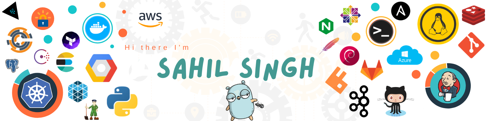

<h1 align="left">Hey 👋 What's up?</h1>

###

I'm a tech enthusiast who loves to learn about new things. Connect with me on LinkedIn.

###

  
  
  

###

<h2 align="left">About me</h2>

###

✨ Initial Commit: 2022 🌱 Learning: Full-Stack, AI, & Machine Learning 📚 Current Branch: 4th Year IT @ Narula Institute 🎯 Goals: Building AI tools for real-world problems 🎲 Fun fact: Outside of coding, I’ve spent the last year mastering the discipline of a high-performance fitness routine.

###

<h1 align="left">I code with</h1>

###

👨🏻‍💻 Languages and Tools

###

  
  
  
  
  
  
  
  
  
  
  
  
  
  
  
  
  

###
